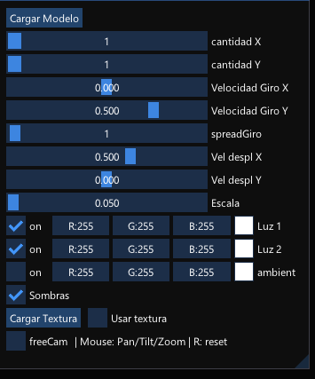

# movvvvedorDeObjetos
Spout enabled VJing tool for  displaying, replicating and moving 3D Objects. \
Available in .VL and Executable flavors\
(Currently) Developed in VVVV Gamma 6.7

movedor de objetos en 3d y replicador - con salida spout.\
En version .VL y ejecutable standalone\
Hecho y exportado en VVVV Gamma 6.7

https://github.com/lisandroperalta/movvvvedor/assets/23583735/e6af0783-e1cd-4dfc-8fac-be3c4de33347

# Disclaimer
Movvvvedor es una herramienta que he desarrollado para atender mis necesidades y exploraciones personales. Aunque está disponible para descarga gratuita y puede ser utilizada y modificada según sus necesidades, es importante tener en cuenta que algunas decisiones de diseño responden a criterios y preferencias personales. Siéntase libre de adaptarlo a sus requerimientos, sin embargo, es poco probable que se acepten modificaciones externas.

Movvvvedor is a tool I created to meet my personal needs and explorations. While it can be downloaded and used for free, certain aspects of the tool are based on personal criteria and preferences. Feel free to use and modify it as you wish, but it is unlikely that external modifications will be accepted.

## Donations:
Although it started as a hobby, I realized that doing this takes time and effort, and little by little, it’s becoming a serious tool. So, any donations to help me buy some coffee are appreciated so I can continue doing it. ☕ \
It can be made in Argentinian pesos or bitcoin ⏬ \
Also, feel free to tag me on IG @lisandro.peralta or post using the #movvvvedor tag

# Download 

**https://github.com/lisandroperalta/movvvvedorDeObjetos/releases/**

## Some free 3D models to try

**https://github.com/lisandroperalta/movvvvedorDeObjetos/tree/main/modelos3DParaProbar**

# Change log

## Latest Version: 009
**Important:** since its upgraded to Gamma 6.7 there may be some issues on first time launching, check the Troubleshooting section (written for the 5.2 version) just in case.\
CHANGED] Reordered the menu
[NEW] Added a lot of RESET buttons to the values that matter most
[NEW] Global rotation that affects the objs as a whole and doesn´t affect the camera (thus, the lights)
[NEW] ANCHOR parameter, test it and tell me what you think
[NEW] Slowly adding a damper to some values to smooth the reaction
[NEW] Lights can be static or can be moving as used to do

## version 008

**Important:** since its upgraded to Gamma 6.4 there may be some issues on first time launching, check the Troubleshooting section (written for the 5.2 version) just in case.\

[CHANGED] Lot of small and silly mistakes fixed thanks to the thoughtful feedback from my bro Fede Gonzalez ( @primeramentedg in IG )\
[CHANGED] Now it is called just "movvvedor" for the sake of simplicity\
[NEW] Slowly migrating GUI to english for universal reasons\
[NEW] Additive texture mode\
[NEW] Billboard mode makes all the objects always face to the camera\
[NEW] Metalness/Roughness material properties\
[NEW] Enviroment textures\
[CHANGED] Redesigned collapsable GUI with colors for readability\
[CHANGED] Migrated to the new VVVV Gamma 6.4 wich promises is faster than the previous\
[CHANGED] Custom resolution output

## version 007
Forgot to upload it because of summer vacations.

## version 006

Mucho laburo que no se vé, sobre todo GRAN MEJORA DEL RENDIMIENTO 

-[CHANGED] Repatcheado de las pasadas de salida, ya no se dibuja dos veces la escena lo que trae un gran aumento del rendimiento. 

-[NEW] Se puede elegir si la salida es 720 o 1080

-[NEW] Se reordenó todo el menú y ahora las secciones son colapsables

-[NEW] Se agregó control independiente de offset en X e y (espaciado entre objetos)

-[NEW] Se agregó una opcion de SPOUT INPUT. La entrada se puede usar para controlar la escala de cada objeto y para controlar el color eligiendo si se aplica toda la textura a cada objeto o si semapea cada uno de acuerdo a su posicion en la grilla

##  version 005

Bastante laburo que no se ve, pero lo que se ve es lo siguiente:

-[NEW] Control independiente de velocidad de giro en X e Y (el 0 tiene una tolerancia para que sea mas facil detenerlo)

-[NEW] Control independiente de velocidad de desplazamiento en X e Y (el 0 tiene una tolerancia para que sea mas facil detenerlo)

-[NEW] Control de encendido y apagador de cada una de las luces (deberia ahorrar recursos, no sé)

-[NEW] Control de color de la luz ambiente

-[CHANGED] Se configuro la salida a 1920x1080

##  version: 004

-[NEW] se pueden cargar varias texturas, se distribuirán de acuerdo a los objetos que haya

-[NEW] el quad se adapta al aspect ratio de cada textura cargada

-[FIX] para evitar crasheos, no se puede usar objeto 3d si antes no se carga uno 

-[NEW] checkbox para usar la camara con el mouse o no

-[NEW] clonado en x e y 

-[NEW] velocidad de giro ahora permite no girar el objeto

-[FIX] ahora no hay saltos en el giro, todos los objetos dan un giro completo

-[NEW] spread de giro define cada cuántas repeticiones se desfasa un objeto

-[NEW] las luces se mueven lentamente (para lograr que iluminen desde todos los ángulos posibles)

-[NEW] medidor de fps 

-[HOTFIX] corregida la velocidad de desplazamiento, ahora 0 la detiene por completo

-[CHANGED] se modifico la manera de recortar el alpha de las texturas en modo quad, ahora debería estar mejor

*Nota:* se puede hacer pan/tilt/orbit/zoom con el mouse. Presionando R se reestablece la camara

##  version: 003
-Agregado más opciones de movimiento
-Agregado de opcion de usar textura o no

# Descargar 

**https://github.com/lisandroperalta/movvvvedorDeObjetos/releases/**

---------------------------------------------------
## Modelos 3d para probar en

**https://github.com/lisandroperalta/movvvvedorDeObjetos/tree/main/modelos3DParaProbar**

---------------------------------------------------
## Troubleshooting

## TL;DR: At the end of the day, you can always install the latest version of VVVV Gamma https://visualprogramming.net/download/ and it will install all the neccesary dependencies 

**Si no funciona, se puede probar instalando las siguientes dependencias (extraido de https://thegraybook.vvvv.org/reference/hde/exporting.html#dependencies )**

**Dependencies**
If your application is referencing VL.Stride, make sure the target PC also has the following dependencies installed:

Microsoft Visual C++ Redistributables 2013 
https://aka.ms/highdpimfc2013x64enu

Microsoft Visual C++ Redistributables 2015 https://aka.ms/vs/17/release/vc_redist.x64.exe

.NET6 SDK (For FileTexture and FileModel nodes to work) https://dotnet.microsoft.com/en-us/download/dotnet/6.0

---------------------------

### IMPORTANTE
Probando, con @jpupper encontramos que puede ser que ande instalando además, este otro sdk

https://dotnet.microsoft.com/en-us/download/dotnet/thank-you/sdk-6.0.403-windows-x64-installer

*En todo caso, con instalando el vvvv gamma funciona, aunque no lo use*
https://teamcity.vvvv.org/guestAuth/app/rest/builds/id:37342/artifacts/content/vvvv_gamma_5.2_setup.exe
